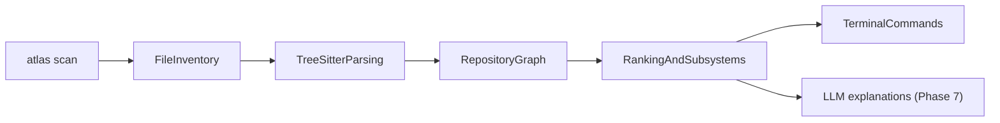

# Atlas

**Repository intelligence for large codebases — not another AI coding assistant.**

Atlas helps you understand what a system does, how it is organized, which files matter most, and what to read first. It builds a structured map of your repository and answers questions from that map. LLMs (if used later) only explain evidence Atlas already found — they do not discover it.

---

## What Atlas answers

- What does this system do?
- How is it organized?
- What are the most important files?
- How does a feature work? *(later phases)*
- What should I read first? *(later phases)*
- What happens if I modify this component? *(later phases)*

## What Atlas does **not** do

- Write or modify production code
- Replace your IDE or code review
- Run autonomous agents or create pull requests
- Require cloud services for core analysis (everything stays local)

---

## How it works



1. **Scan** — walk the repo, respect `.gitignore`, skip junk (`node_modules`, build output, etc.)
2. **Parse** — Tree-sitter extracts structure (imports, functions, calls)
3. **Graph** — nodes and edges stored in SQLite under `.atlas/`
4. **Intelligence** — ranking, subsystems, flows (deterministic, no AI)
5. **Commands** — terminal output you can read in minutes
6. **LLM** *(later)* — optional plain-English explanations grounded in graph slices

**Core principle:** the repository graph is the source of truth. The LLM is a narrator, not a detective.

---

## Commands

| Command | Phase | Description |
|---------|-------|-------------|
| `atlas scan .` | 1+ | Analyze a repository and write `.atlas/` |
| `atlas scan . --force` | 5+ | Delete and rebuild `.atlas/` from scratch |
| `atlas scan . --list` | 1+ | Same as above, plus print file paths (up to 50) |
| `atlas top-files` | 3+ | Show importance-ranked files from `.atlas/graph.db` |
| `atlas architecture` | 4+ | Subsystems, entrypoints, and critical files |
| `atlas flow <name> [path]` | 6+ | Trace an execution path (e.g. `atlas flow core .`) |
| `atlas learn <topic> [path]` | 6+ | Recommended reading order for a subsystem |
| `atlas explain <topic> [path] [--no-llm]` | 7 | Graph-grounded explanation with overview, citations, and code snippets |

### First milestone (zero LLM) — complete

### v1 command set — complete

Run this workflow on any supported repository:

```powershell
cargo build --release

# Recommended: realistic Python backend (~30 files)
.\target\release\atlas.exe scan tests/fixtures/demo_app --force
.\target\release\atlas.exe architecture tests/fixtures/demo_app
.\target\release\atlas.exe top-files tests/fixtures/demo_app
.\target\release\atlas.exe flow login tests/fixtures/demo_app
.\target\release\atlas.exe learn auth tests/fixtures/demo_app
.\target\release\atlas.exe explain auth tests/fixtures/demo_app --no-llm

# Stress test: messy half-migrated backend
.\target\release\atlas.exe scan tests/fixtures/ugly_app --force
.\target\release\atlas.exe flow login tests/fixtures/ugly_app
.\target\release\atlas.exe explain auth tests/fixtures/ugly_app --no-llm

# Minimal C smoke test (3 files)
.\target\release\atlas.exe scan tests/fixtures/c_sample --force
.\target\release\atlas.exe architecture tests/fixtures/c_sample
.\target\release\atlas.exe top-files tests/fixtures/c_sample
.\target\release\atlas.exe flow core tests/fixtures/c_sample
.\target\release\atlas.exe learn include tests/fixtures/c_sample
```

See [tests/fixtures/README.md](tests/fixtures/README.md) for fixture details and [tests/benchmarks/README.md](tests/benchmarks/README.md) for real-repo benchmarks (e.g. Starlette).

During `scan`, progress appears on stderr (`→ Inventorying`, `→ Parsing`, `→ Building graph`). The summary includes nodes, edges, definitions, imports, and calls.

For a real C project (e.g. Linux kernel subtree):

```powershell
.\target\release\atlas.exe scan C:\path\to\linux\drivers\gpu\drm --force
.\target\release\atlas.exe architecture C:\path\to\linux\drivers\gpu\drm
.\target\release\atlas.exe top-files C:\path\to\linux\drivers\gpu\drm --limit 20
```

---

## You don't need to know Rust

Atlas is written in Rust for speed and a single portable binary. **You do not need to read or write Rust** to use or monitor the project. Follow [ROADMAP.md](ROADMAP.md), run the verify commands after each phase, and paste terminal output into Cursor if something breaks.

---

## Prerequisites

| Requirement | When needed | Notes |
|-------------|-------------|-------|
| **Rust toolchain** | Phase 0 onward | `rustc` + `cargo` via [rustup](https://rustup.rs/) |
| **Git** | Optional | Useful for cloning repos to scan |
| **A terminal** | Always | PowerShell or Windows Terminal on Windows |

### Install Rust on Windows (one-time, manual)

If `rustc --version` fails in your terminal:

1. Open [https://rustup.rs](https://rustup.rs) and download **rustup-init.exe**
2. Run it — accept defaults (installs to `%USERPROFILE%\.cargo\bin`)
3. **Close and reopen** your terminal (PATH update)
4. Verify:

```powershell
rustc --version
cargo --version
```

First `cargo build` downloads dependencies and can take several minutes. That is normal.

---

## Build and run (after Phase 0)

From this repository:

```powershell
# Development run
cargo run -- scan C:\path\to\some-repo

# Release binary (faster)
cargo build --release
.\target\release\atlas.exe scan C:\path\to\some-repo
.\target\release\atlas.exe architecture
.\target\release\atlas.exe top-files
```

Run commands from inside the repo you want to analyze, or pass an explicit path to `scan`.

**Colors:** Atlas uses terminal colors by default (cyan headings, blue paths, green/yellow/red counts). To disable them, set `NO_COLOR=1` in your environment.

---

## Local data: `.atlas/`

After `atlas scan`, Atlas writes a hidden folder in the scanned repository:

```text
.atlas/
  inventory.json   # file list from scan
  symbols.json     # parsed definitions, imports, calls
  graph.db         # SQLite graph and file scores
```

- Safe to delete — run `atlas scan` again to rebuild
- Not meant for version control (listed in `.gitignore`)
- Stays on your machine — no upload required for core features

---

## Supported languages (MVP)

**Phase 2+:** Python, TypeScript, JavaScript, Go, **C** (`.c`, `.h`)

**Later:** Rust, Java, C#, C++, Kotlin

Unsupported files are skipped gracefully during scan. Files over 5MB are not parsed (counted as `too large`).

### Linux kernel note

C support is included for kernel-scale projects, but expect **approximate** results: `#include` is not a full dependency graph, macros are invisible to Tree-sitter, and a full kernel scan will take a long time. Start with a subsystem (e.g. `drivers/gpu/drm/`) before scanning the entire tree.

---

## Project layout (as we build)

```text
atlas/
├── README.md
├── ROADMAP.md
├── Cargo.toml
└── src/
    ├── main.rs
    ├── cli/            # command definitions
    ├── scan/           # filesystem walker
    ├── parse/          # tree-sitter
    ├── graph/          # nodes, edges, sqlite
    └── intelligence/   # ranking, subsystems, flows
```

---

## Roadmap and progress

All build work is tracked in **[ROADMAP.md](ROADMAP.md)** — phases, checkboxes, verify steps, and debugging tips.

**Current project status:** Phase 6 complete (`flow`, `learn`). Say **"Start Phase 7"** for LLM explanations.

---

## Getting help when something breaks

1. Note which **ROADMAP phase** you are on
2. Copy the **full terminal output**
3. Paste it into Cursor chat
4. Try deleting `.atlas/` in the target repo and scanning again
5. Try a **smaller repository** to isolate the issue

See the debugging section in [ROADMAP.md](ROADMAP.md) for a symptom → cause → fix table.
