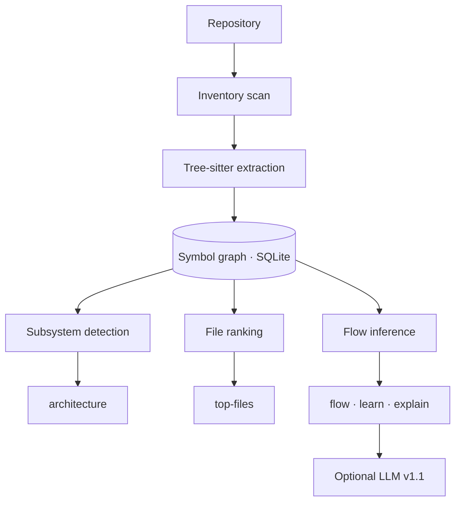

<div align="center">

# Atlas

**Get oriented in minutes, not half a day.**

A map for repos you didn't write. Most onboarding starts by opening random folders and hoping the architecture eventually reveals itself. Atlas builds a graph first, then shows you where to read.

Built for real projects with dozens to thousands of files: too large to skim in one pass, too small to justify weeks of onboarding. Local cache. No account. No cloud.

> **The graph is the product.** Everything else (ranking, flows, explain) reads from that graph. Optional LLM narration in v1.1 must cite it, not invent paths.

<br/>

[](https://github.com/rohan1903/atlas/releases/tag/v1.0.0)
[](https://www.rust-lang.org/)
[](#installation)
[](#local-cache-atlas)
[](LICENSE)

<br/>

[Try it](#try-it) ·
[Why Atlas](#why-atlas) ·
[Why not an LLM?](#why-not-just-ask-an-llm) ·
[Install](#installation) ·
[Commands](#commands)

</div>

---

## Try it

Three commands. Output below is from the bundled [demo_app](tests/fixtures/demo_app) fixture (8 subsystems, cross-folder imports):

```powershell
cargo install --path .          # once, from a clone of this repo
atlas scan tests/fixtures/demo_app --force
atlas architecture tests/fixtures/demo_app
atlas flow login tests/fixtures/demo_app
```

**Architecture** (where the pieces live):

```text
Repository: demo_app

Subsystems
  1. Auth (5 files, score 53, internal links 3)
     top: auth/service.py, auth/routes.py, auth/token.py
  2. Orders (4 files, score 35, internal links 2)
     top: orders/service.py, orders/routes.py, orders/repository.py
  3. Users (4 files, score 34, internal links 2)
     top: users/repository.py, users/service.py, users/models.py
  4. Payments (3 files, score 15, internal links 1)
     top: payments/service.py, payments/gateway.py, payments/__init__.py
  ...

Entrypoints
  - main.py

Critical files
  1.    45  main.py
  2.    20  auth/service.py
  3.    17  orders/service.py
```

**Flow** (where execution goes; folders alone won't show this):

```text
Flow: login
  seed login_handler

                          ╭──────────────────────────╮
                          │      login_handler       │
                          │    auth/routes.py:21     │
                          ╰─────────────┬────────────╯
                                        │
                                        ▼
                          ╭──────────────────────────╮
                          │          login           │
                          │    auth/service.py:16    │
                          ╰─────────────┬────────────╯
                                        │
                                        ▼
                          ╭──────────────────────────╮
                          │       get_by_email       │
                          │  users/repository.py:10  │
                          ╰─────────────┬────────────╯
                                        │
                                       ...
```

Browsing folders tells you *where files are*. **`atlas flow`** tells you *what runs when you touch login, check-in, or auth*. Then `learn` and `explain` suggest reading order ([more examples](#example-output)).

Also try [ugly_app](tests/fixtures/ugly_app) (messy on purpose) or your own repo after `atlas scan ./your-repo --force`.

---

## Why Atlas

New repo, same questions every time:

- Where are the actual subsystems?
- What files matter?
- If I need to touch *auth* or *check-in*, where does execution start?

Atlas answers from **structure**: scan, parse, graph, rank, trace. No LLM in the loop for v1. `explain --no-llm` pulls real citations and snippets from the graph.

| Atlas **is** | Atlas **is not** |
|--------------|------------------|
| A fast onboarding map | Another AI coding agent |
| Local (`.atlas/` on disk) | A hosted analysis SaaS |
| Graph + heuristics you can inspect | Magic that invents file paths |
| Honest when the graph is approximate | A replacement for reading code |

---

## Why not just ask an LLM?

LLMs explain code. Atlas finds the structure.

LLMs can summarize what they've read. Atlas tells you **what to read first** and **how pieces connect**.

**Without Atlas:** LLM → entire repo (guesses, missing files, invented paths)

**With Atlas:** LLM → Atlas graph → repo (subsystems, entrypoints, call paths, ranked files)

Atlas builds the graph deterministically:

- subsystem boundaries
- entrypoints
- static call paths
- importance-ranked files

v1 ships graph-grounded templates (`explain --no-llm`). v1.1 adds optional LLM narration **on top of** that evidence. The graph stays the source of truth.

---

## Installation

You need [Rust](https://rustup.rs/) 1.70+ (`rustc`, `cargo`).

```powershell
git clone https://github.com/rohan1903/atlas.git
cd atlas
cargo install --path .
atlas --help
```

| OS | Binary |
|----|--------|
| Windows | `%USERPROFILE%\.cargo\bin\atlas.exe` |
| Linux / macOS | `~/.cargo/bin/atlas` |

Then `atlas scan`, `atlas flow login`, etc. from any directory.

<details>
<summary><strong>First time with Rust on Windows?</strong></summary>

1. Grab [rustup.rs](https://rustup.rs/) (defaults are fine).
2. Restart your terminal.
3. `rustc --version`, `cargo --version`, `atlas --help`.

First `cargo install` pulls deps and can take a few minutes.

</details>

<details>
<summary><strong>Don't want to install globally?</strong></summary>

```powershell
cargo build --release
cargo run --release -- scan tests/fixtures/demo_app --force
```

</details>

---

## Commands

| Command | What it does |
|---------|----------------|
| `atlas scan [path]` | Walk repo, parse, write graph to `.atlas/` |
| `atlas scan --force` | Rebuild cache from scratch |
| `atlas architecture [path]` | Subsystems, entrypoints, critical files |
| `atlas top-files [path]` | Ranked **code files** (skips tests/docs by default) |
| `atlas top-files --include-tests` | Include test files |
| `atlas top-files --include-metadata` | Include README, configs, requirements, etc. |
| `atlas flow <name> [path]` | Compressed execution path (box diagram) |
| `atlas flow <name> --verbose` | Full call graph |
| `atlas learn <topic> [path]` | Suggested reading order (box diagram) |
| `atlas explain <topic> [path] --no-llm` | Overview, walkthrough, citations, snippets |

`--color` forces highlighting. `NO_COLOR=1` turns it off.

<details>
<summary><strong>What the rank score means</strong></summary>

When you see `score` in `architecture` or `top-files`, that's a **heuristic importance number** from the static graph, not LOC or git blame.

| Signal | Weight | Meaning |
|--------|--------|---------|
| Inbound refs | ×3 | Other files import or call into this one |
| Outbound refs | ×0.5 | This file imports or calls outward |
| Definitions | ×0.3 | Functions/classes defined here |
| Entrypoint | +40 | Likely app entry (`main.py`, `index.ts`, etc.) |

Path penalties: tests (×0.05), docs/config (×0.1), vendor-ish paths (×0.25). Subsystem scores sum file scores in that cluster. **Use ordering, not absolute numbers** (80 on one repo ≠ 80 on another).

</details>

---

## Example output

`architecture` and `top-files` use plain lists. **`flow`**, **`learn`**, and **`explain`** stack box diagrams with `▼` between steps.

**Flow** (`atlas flow login tests/fixtures/demo_app`):

```text
Flow: login
  seed login_handler

                          ╭──────────────────────────╮
                          │      login_handler       │
                          │    auth/routes.py:21     │
                          ╰─────────────┬────────────╯
                                        │
                                        ▼
                          ╭──────────────────────────╮
                          │          login           │
                          │    auth/service.py:16    │
                          ╰─────────────┬────────────╯
                                        │
                                       ...
```

**Learn** and **explain** use the same box style for reading order, then citations and syntax-highlighted snippets below. See `atlas learn auth` / `atlas explain auth --no-llm` on [demo_app](tests/fixtures/demo_app).

---

## How it works



1. **Scan:** `.gitignore`, skip `node_modules` and build junk.
2. **Parse:** imports, definitions, calls (best effort).
3. **Graph:** persisted in `.atlas/graph.db`.
4. **Intelligence:** cluster subsystems, rank files, seed flows, template explain.
5. **Output:** terminal reports in minutes, not hours of folder spelunking.

---

## Supported languages

| Language | Extensions | Status |
|----------|------------|--------|
| Python | `.py` | Works |
| TypeScript / JavaScript | `.ts`, `.tsx`, `.js`, `.jsx` | Works |
| Go | `.go` | Works |
| C | `.c`, `.h` | Works (rough on huge/kernel trees) |

**Next up (v1.1+):** Rust, Java, C#, C++, Kotlin. Unsupported files are skipped; scan summary shows counts. Files over 5 MB are not parsed.

---

## Local cache: `.atlas/`

```text
.atlas/
  inventory.json   # what got scanned
  symbols.json     # parsed symbols
  graph.db         # the graph + scores
```

Lives in the **repo you scanned**, not next to the Atlas binary. Delete anytime; `atlas scan --force` rebuilds. Gitignored. Your machine only.

---

## Limitations (v1)

Shipped what works. Known gaps:

- **Static graph only.** Reflection, dynamic dispatch, framework magic = holes.
- **Flows name functions**, not user-facing steps like "validate token" (v1.1).
- **No confidence scores** on guessed vs traced edges yet (v1.1).
- **`explain` without `--no-llm`** waits on v1.1 Ollama/API wiring.

**v1.1 ideas:** behavior tracing, confidence labels, `atlas impact`, Rust grammar, optional LLM narration.

---

## Development

```powershell
cargo test
cargo install --path .
```

Contributors: run `cargo test` and try the fixtures before opening a PR.

**Shipped:** [v1.0.0](https://github.com/rohan1903/atlas/releases/tag/v1.0.0).

---

## Getting help

1. `atlas scan --force` after the repo changed.
2. Paste full terminal output + which command broke.
3. Reproduce on a fixture if you can.
4. Open a GitHub issue with repro steps.

---

## License

[MIT](LICENSE). Copyright (c) 2026 Rohan.

---

<div align="center">

**Atlas v1.0.0** · repository onboarding, built in public

</div>
