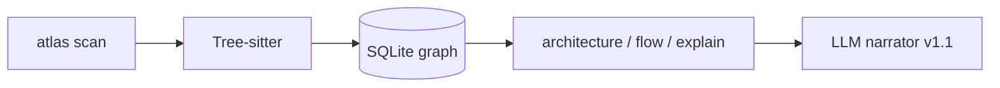

<div align="center">

# Atlas

**A map for codebases you didn't write. Built from structure, not LLM guesses.**

Scan a repo. Get architecture, ranked files, and feature flows in your terminal. Local cache, no account, no cloud.

<br/>

[](https://github.com/rohan1903/atlas/releases/tag/v1.0.0)
[](https://www.rust-lang.org/)
[](#installation)
[](#local-cache-atlas)
[](LICENSE)

<br/>

[Installation](#installation) ·
[Quick start](#quick-start) ·
[Commands](#commands) ·
[Example output](#example-output) ·
[Roadmap](ROADMAP.md)

</div>

---

## Why Atlas

New repo, same questions every time:

- Where are the actual subsystems?
- What files matter?
- If I need to touch *auth* or *check-in*, where does execution start?

Atlas answers from **structure**: scan, parse, graph, rank, trace. No LLM in the loop for v1. `explain --no-llm` pulls real citations and snippets from the graph. LLM narration comes in v1.1, optional, on top of the same evidence.

| Atlas **is** | Atlas **is not** |
|--------------|------------------|
| A fast onboarding map | Another AI coding agent |
| Local (`.atlas/` on disk) | A hosted analysis SaaS |
| Graph + heuristics you can inspect | Magic that invents file paths |
| Honest when the graph is approximate | A replacement for reading code |

---

## Installation

You need [Rust](https://rustup.rs/) 1.70+ (`rustc`, `cargo`). One install command puts `atlas` on your PATH.

```powershell
git clone https://github.com/rohan1903/atlas.git
cd atlas
cargo install --path .
atlas --help
```

That installs to:

| OS | Binary |
|----|--------|
| Windows | `%USERPROFILE%\.cargo\bin\atlas.exe` |
| Linux / macOS | `~/.cargo/bin/atlas` |

Then it's just `atlas scan`, `atlas flow login`, etc. No `.\target\release\...` nonsense.

<details>
<summary><strong>First time with Rust on Windows?</strong></summary>

1. Grab [rustup.rs](https://rustup.rs/) (defaults are fine).
2. Restart your terminal.
3. `rustc --version`, `cargo --version`, `atlas --help`.

First `cargo install` pulls deps and can take a few minutes. Coffee helps.

</details>

<details>
<summary><strong>Don't want to install globally?</strong></summary>

From the repo:

```powershell
cargo build --release
cargo run --release -- scan tests/fixtures/demo_app --force
```

Or patch PATH for one session:

```powershell
$env:Path += ";$PWD\target\release"
atlas scan tests/fixtures/demo_app --force
```

</details>

---

## Quick start

Point it at any repo. Cache lands in `.atlas/` inside that repo.

```powershell
atlas scan tests/fixtures/demo_app --force
atlas architecture tests/fixtures/demo_app
atlas top-files tests/fixtures/demo_app
atlas flow login tests/fixtures/demo_app
atlas learn auth tests/fixtures/demo_app
atlas explain auth tests/fixtures/demo_app --no-llm
```

Same on Linux/macOS after `cargo install --path .`.

Try the fixtures: [demo_app](tests/fixtures/demo_app) (clean), [ugly_app](tests/fixtures/ugly_app) (messy on purpose). Bigger smoke test: [Starlette](tests/benchmarks/README.md).

---

## Commands

| Command | What it does |
|---------|----------------|
| `atlas scan [path]` | Walk repo, parse, write graph to `.atlas/` |
| `atlas scan --force` | Nuke cache and rebuild |
| `atlas architecture [path]` | Subsystems, entrypoints, critical files |
| `atlas top-files [path]` | Ranked **code files** (skips tests/docs by default) |
| `atlas top-files --include-tests` | Include test files |
| `atlas top-files --include-metadata` | Include README, configs, requirements, etc. |
| `atlas flow <name> [path]` | Compressed execution path |
| `atlas flow <name> --verbose` | Full call graph dump |
| `atlas learn <topic> [path]` | Suggested reading order for a topic |
| `atlas explain <topic> [path] --no-llm` | Overview + walkthrough + citations + snippets |

`--color` forces highlighting. `NO_COLOR=1` turns it off.

---

## What the rank score means

When you run `top-files` or see `score` in `architecture`, that's a **heuristic importance number**, not lines of code or git blame stats. Higher = more central in the static graph.

Per file, Atlas starts from graph signals:

| Signal | Weight | Meaning |
|--------|--------|---------|
| Inbound refs | ×3 | Other files import or call into this one |
| Outbound refs | ×0.5 | This file imports or calls outward |
| Definitions | ×0.3 | Functions/classes defined here |
| Entrypoint | +40 | Likely app entry (`main.py`, `index.ts`, etc.) |

Then it applies path penalties: tests (×0.05), docs/config (×0.1), generated or vendor-ish paths (×0.25). By default, `top-files` also hides tests and metadata entirely unless you pass `--include-tests` or `--include-metadata`.

**Subsystem scores** in `architecture` are the sum of file scores in that folder cluster. Use them to compare which part of the repo looks busiest, not as an objective quality metric.

The number is relative to your repo. A score of 80 on one project doesn't mean the same thing on another. Treat the ordering as the useful part.

---

## Example output

**Architecture** (skim this before opening random folders):

```text
Subsystems
  1. Auth (5 files, score 42, internal links 3)
     top: auth/routes.py, auth/service.py, auth/repository.py
  2. Orders (4 files, ...)

Entrypoints
  - main.py
  - api/router.py
```

**Flow** (default is compressed; `--verbose` for everything):

```text
Flow: login
  seed login_handler

  login_handler  →  login  →  get_by_email  →  verify_password  →  create_access_token
```

**Explain** (v1 = templates + real citations, no LLM):

```text
Topic: auth
Citations
  1. auth/routes.py @ login_handler:21
  2. auth/service.py @ login:16
Snippets
  (syntax-highlighted source from those files)
```

---

## How it works



1. **Scan:** respect `.gitignore`, skip `node_modules` and build junk.
2. **Parse:** Tree-sitter pulls imports, defs, calls (best effort).
3. **Graph:** SQLite in `.atlas/graph.db`.
4. **Intelligence:** rank files, cluster subsystems, seed flows, template explain.
5. **Output:** terminal reports you can read in a few minutes.

The graph is the product. Any LLM layer (v1.1) has to cite that graph. No invented structure.

---

## Supported languages

| Language | Extensions | Status |
|----------|------------|--------|
| Python | `.py` | Works |
| TypeScript / JavaScript | `.ts`, `.tsx`, `.js`, `.jsx` | Works |
| Go | `.go` | Works |
| C | `.c`, `.h` | Works (rough on huge/kernel trees) |

**Next up (v1.1+):** Rust, Java, C#, C++, Kotlin.

Everything else gets skipped; scan summary tells you how many. Files over 5 MB are skipped too.

---

## Local cache: `.atlas/`

```text
.atlas/
  inventory.json   # what got scanned
  symbols.json     # parsed symbols
  graph.db         # the graph + scores
```

Lives in the **repo you scanned**, not next to the Atlas binary. Delete it anytime; `atlas scan --force` rebuilds. Gitignored. Your machine only.

---

## Limitations (v1, on purpose)

Shipped what works. Known gaps:

- **Static graph only.** Reflection, dynamic dispatch, framework magic = holes.
- **Flows name functions**, not user-facing steps like "validate token" (v1.1).
- **No confidence scores** on guessed vs traced edges yet (v1.1).
- **`explain` without `--no-llm`** waits on v1.1 Ollama/API wiring.

Full backlog: [ROADMAP.md](ROADMAP.md).

---

## Project layout

```text
src/
  scan/           filesystem inventory
  parse/          tree-sitter extraction
  graph/          SQLite nodes, edges, ranking
  intelligence/   subsystems, flows, explain
  commands/       CLI output
tests/fixtures/   demo_app, ugly_app, c_sample
```

---

## Development

```powershell
cargo test
cargo install --path .   # puts `atlas` on PATH
cargo build --release    # or just build under target/release/
```

Build log and verify steps: [ROADMAP.md](ROADMAP.md).

**Shipped:** [v1.0.0](https://github.com/rohan1903/atlas/releases/tag/v1.0.0) with `scan`, `architecture`, `top-files`, `flow`, `learn`, `explain --no-llm`.

---

## Getting help

1. `atlas scan --force` after the repo changed.
2. Paste full terminal output + which command broke.
3. Reproduce on a fixture if you can.
4. [ROADMAP.md](ROADMAP.md) has a debugging section.

Issues welcome on GitHub.

---

## License

[MIT](LICENSE). Copyright (c) 2026 Rohan.

---

<div align="center">

**Atlas v1.0.0** · graph-first onboarding, built in public

</div>
