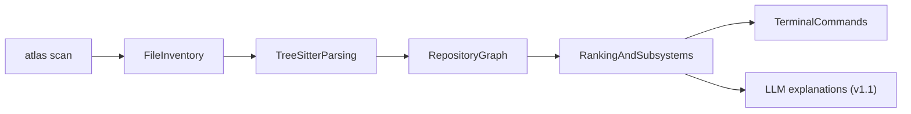

<div align="center">

# Atlas

**Repository intelligence for large codebases — not another AI coding assistant.**

Understand what a system does, which files matter, and what to read first — from a deterministic graph, not an LLM guess.

<br/>

[](https://www.rust-lang.org/)
[](ROADMAP.md)
[](#prerequisites)
[](#local-data-atlas)

<br/>

**Parsed languages**

[](#supported-languages-mvp)
[](#supported-languages-mvp)
[](#supported-languages-mvp)
[](#supported-languages-mvp)
[](#supported-languages-mvp)

<br/>

[Quick start](#quick-start) ·
[Commands](#commands) ·
[How it works](#how-it-works) ·
[Roadmap](ROADMAP.md)

</div>

---

## What Atlas answers

| Question | Command |
|----------|---------|
| What does this system do? | `atlas architecture` |
| How is it organized? | `atlas architecture` |
| What are the most important files? | `atlas top-files` |
| How does a feature work? | `atlas flow` · `atlas explain` |
| What should I read first? | `atlas learn` |
| How does execution get here? | `atlas explain` |

## What Atlas does **not** do

- Write or modify production code
- Replace your IDE or code review
- Run autonomous agents or create pull requests
- Require cloud services for core analysis (everything stays local)

---

## How it works



| Step | What happens |
|------|----------------|
| **Scan** | Walk the repo, respect `.gitignore`, skip junk (`node_modules`, build output, etc.) |
| **Parse** | Tree-sitter extracts structure (imports, functions, calls) |
| **Graph** | Nodes and edges stored in SQLite under `.atlas/` |
| **Intelligence** | Ranking, subsystems, flows — deterministic, no AI |
| **Commands** | Terminal output you can read in minutes |
| **LLM** *(v1.1)* | Optional narration grounded in graph evidence |

**Core principle:** the repository graph is the source of truth. The LLM is a narrator, not a detective.

---

## Commands

| Command | Description |
|---------|-------------|
| `atlas scan .` | Analyze a repository and write `.atlas/` |
| `atlas scan . --force` | Delete and rebuild `.atlas/` from scratch |
| `atlas scan . --list` | Print inventoried file paths (up to 50) |
| `atlas top-files` | Show importance-ranked **code files** (tests and docs/config excluded by default) |
| `atlas top-files --include-tests` | Include test files in the ranked list |
| `atlas top-files --include-metadata` | Include docs, config, and deployment files |
| `atlas architecture` | Subsystems, entrypoints, and critical files |
| `atlas flow <name> [path]` | Trace an execution path (e.g. `atlas flow login`) |
| `atlas flow <name> --verbose` | Full call graph instead of compressed primary path |
| `atlas learn <topic> [path]` | Recommended reading order for a subsystem |
| `atlas explain <topic> [path] [--no-llm]` | Graph-grounded explanation with citations and snippets |
| `atlas --color explain …` | Force syntax highlighting in snippets |

---

## Quick start

```powershell
git clone https://github.com/rohan1903/atlas.git
cd atlas
cargo build --release

# Recommended: realistic Python backend (~30 files)
.\target\release\atlas.exe scan tests/fixtures/demo_app --force
.\target\release\atlas.exe architecture tests/fixtures/demo_app
.\target\release\atlas.exe top-files tests/fixtures/demo_app
.\target\release\atlas.exe flow login tests/fixtures/demo_app
.\target\release\atlas.exe learn auth tests/fixtures/demo_app
.\target\release\atlas.exe explain auth tests/fixtures/demo_app --no-llm

# Stress test: messy half-migrated backend
.\target\release\atlas.exe scan tests/fixtures/ugly_app --force
.\target\release\atlas.exe flow login tests/fixtures/ugly_app
.\target\release\atlas.exe explain auth tests/fixtures/ugly_app --no-llm
```

<details>
<summary><strong>Linux / macOS</strong></summary>

```bash
git clone https://github.com/rohan1903/atlas.git
cd atlas
cargo build --release

./target/release/atlas scan tests/fixtures/demo_app --force
./target/release/atlas explain auth tests/fixtures/demo_app --no-llm
```

</details>

See [tests/fixtures/README.md](tests/fixtures/README.md) for fixture details and [tests/benchmarks/README.md](tests/benchmarks/README.md) for real-repo benchmarks (e.g. Starlette).

During `scan`, progress appears on stderr (`→ Inventorying`, `→ Parsing`, `→ Building graph`). The summary includes nodes, edges, definitions, imports, and calls.

---

## Prerequisites

| Requirement | Notes |
|-------------|-------|
| **Rust toolchain** | `rustc` + `cargo` via [rustup](https://rustup.rs/) |
| **Git** | Optional — useful for cloning repos to scan |
| **A terminal** | PowerShell, Windows Terminal, or any POSIX shell |

### Install Rust on Windows (one-time)

If `rustc --version` fails in your terminal:

1. Open [https://rustup.rs](https://rustup.rs) and download **rustup-init.exe**
2. Run it — accept defaults (installs to `%USERPROFILE%\.cargo\bin`)
3. **Close and reopen** your terminal (PATH update)
4. Verify:

```powershell
rustc --version
cargo --version
```

First `cargo build` downloads dependencies and can take several minutes. That is normal.

---

## Build and run

```powershell
# Development run
cargo run -- scan C:\path\to\some-repo

# Release binary (faster)
cargo build --release
.\target\release\atlas.exe scan C:\path\to\some-repo
.\target\release\atlas.exe architecture
.\target\release\atlas.exe top-files
```

Run commands from inside the repo you want to analyze, or pass an explicit path to `scan`.

**Colors:** Atlas uses terminal colors by default. Use `--color` to force highlighting, or set `NO_COLOR=1` to disable colors.

---

## Local data: `.atlas/`

After `atlas scan`, Atlas writes a hidden folder in the scanned repository:

```text
.atlas/
  inventory.json   # file list from scan
  symbols.json     # parsed definitions, imports, calls
  graph.db         # SQLite graph and file scores
```

- Safe to delete — run `atlas scan --force` to rebuild
- Not meant for version control (listed in `.gitignore`)
- Stays on your machine — no upload required

---

## Supported languages (MVP)

<div align="center">

[](https://www.python.org/)
[](https://www.typescriptlang.org/)
[](https://developer.mozilla.org/en-US/docs/Web/JavaScript)
[](https://go.dev/)
[](https://en.wikipedia.org/wiki/C_(programming_language))

</div>

**Planned:** Rust, Java, C#, C++, Kotlin

Unsupported files are skipped gracefully during scan. Files over 5MB are not parsed (counted as `too large`).

### Linux kernel note

C support works on kernel-scale projects, but expect **approximate** results: `#include` is not a full dependency graph, macros are invisible to Tree-sitter, and a full kernel scan takes a long time. Start with a subsystem (e.g. `drivers/gpu/drm/`) before scanning the entire tree.

---

## Project layout

```text
atlas/
├── README.md
├── ROADMAP.md
├── Cargo.toml
└── src/
    ├── main.rs
    ├── scan/           # filesystem walker
    ├── parse/          # tree-sitter
    ├── graph/          # nodes, edges, sqlite
    ├── intelligence/   # ranking, subsystems, flows, explain
    └── commands/       # CLI output
```

---

## Roadmap

All build work is tracked in **[ROADMAP.md](ROADMAP.md)** — phases, checkboxes, verify steps, and debugging tips.

**Status:** v1.0.0 shipped (`scan`, `architecture`, `top-files`, `flow`, `learn`, `explain --no-llm`). v1.1 backlog: behavior tracing, confidence scoring, `impact`, Rust parsing, LLM narration.

---

## Getting help

1. Note which **ROADMAP phase** you are on
2. Copy the **full terminal output**
3. Paste it into Cursor chat
4. Delete `.atlas/` in the target repo and run `atlas scan --force` again
5. Try a **smaller repository** to isolate the issue

See the debugging section in [ROADMAP.md](ROADMAP.md) for a symptom → cause → fix table.
